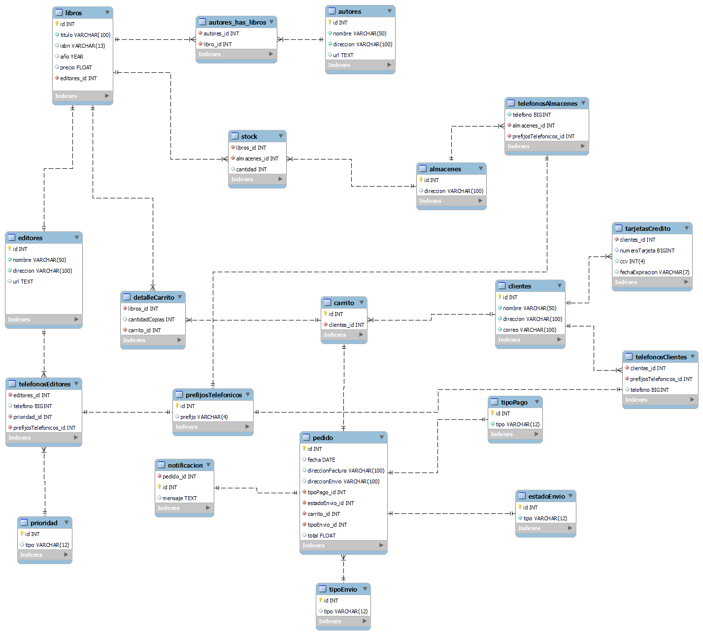

# BASE DE DATOS BIBLIOTECA

## Modelo Conceptual 

Identifique las posibles tablas y campos asociados del escenario proporcionado. Book.com es una tienda virtual en línea en Internet donde los clientes pueden examinar el catálogo y seleccionar los productos que deseen. 

- Cada libro tiene un título, ISBN, año y precio. La tienda también conserva la información del autor y del editor de cualquier libro. 

- Para los autores, la base de datos conserva el nombre, la dirección y la URL de su página inicial. 

- Para los editores, la base de datos conserva el nombre, la dirección, el número de teléfono y la URL de su sitio web. 

- La tienda tiene varios almacenes, cada uno de los cuales tiene un código, una dirección y un número de teléfono. 

- El almacén tiene en stock muchos libros. Un libro puede estar en stock en varios almacenes. 

- La base de datos registra el número de copias de un libro almacenadas en stock en varios almacenes. 

- La librería conserva el nombre, la dirección, el ID de correo electrónico y el número de teléfono de sus clientes. 

- Un cliente es propietario de varios carritos de la compra. El carrito de la compra se identifica mediante un Shopping_Cart_ID y contiene varios libros. 

- Algunos carritos de la compra pueden contener más de una copia del mismo libro. La base de datos registra el número de copias de cada libro que hay en cualquier carrito de la compra. 

- En ese momento, se necesitará más información para completar la transacción. Normalmente, se le pedirá al cliente que rellene o seleccione una dirección de facturación, una dirección de envío, una opción de envío e información de pago como el número de tarjeta de crédito. Se enviará una notificación por correo electrónico al cliente en cuanto se realice el pedido

## Modelo Físico

## Descripcion tablas

### Tabla autores
Esta tabla almacena información sobre los autores de los libros, incluyendo su nombre, dirección y una URL opcional.

### Tabla almacenes
Aquí se guardan registros de los almacenes donde se almacenan los libros, identificados por su dirección.

### Tabla prioridad
Contiene diferentes tipos de prioridades que pueden asignarse a los teléfonos.

### Tabla prefijosTelefonicos
Registra códigos numéricos utilizados para identificar regiones geográficas en sistemas telefónicos.

### Tabla telefonosAlmacenes
Asocia números de teléfono con almacenes específicos.

### Tabla editores
Almacena información sobre las editoriales de libros, incluyendo su nombre, dirección y una URL opcional.

### Tabla telefonosEditores
Similar a telefonosAlmacenes, asocia números de teléfono con editores específicos.

### Tabla libros
Contiene información detallada sobre los libros, incluyendo su título, ISBN, año de publicación, precio y el editor asociado.

### Tabla autores_has_libros
Establece relaciones entre autores y libros, indicando qué autores han contribuido a cada libro.

### Tabla stock
Mantiene un registro del stock de libros en cada almacén, indicando la cantidad disponible de cada título.

### Tabla clientes
Guarda información sobre los clientes, incluyendo su nombre, dirección y correo electrónico.

### Tabla tarjetasCredito
Registra la información de las tarjetas de crédito asociadas a los clientes.

### Tabla telefonosClientes
Asocia números de teléfono con clientes específicos.

### Tabla carrito
Contiene información sobre los carritos de compra de los clientes.

### Tabla detalleCarrito
Registra los detalles de los productos en el carrito de un cliente.

### Tabla tipoPago
Guarda los diferentes tipos de métodos de pago que pueden ser utilizados.

### Tabla estadoEnvio
Contiene los diferentes estados de envío que pueden ser asignados a un pedido.

### Tabla tipoEnvio
Registra los diferentes tipos de métodos de envío disponibles.

### Tabla pedido
Guarda información detallada sobre los pedidos realizados por los clientes.

### Tabla notificacion
Registra notificaciones asociadas a un pedido específico.
